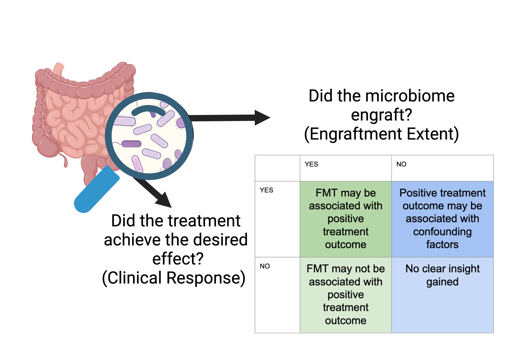

# Assessing Engraftment Extent with q2-FMT
```{usage-scope}
---
name: tutorial
---
```

```{usage-selector}
---
default-interface: cli-usage
---
```

When investigating FMTs, it is really important to understand the extent to which the recipient microbiome engrafted the the donated microbiome. Without assessing engraftment extent, we will never fully understand the clincial outcomes of the study. 


Created with BioRender.

q2-fmt can be used to help you understand engraftment extent following FMT! q2-fmt is an all-in-one suite for assessing engraftment.

There are three criteria for assessing engraftment that are defined in Herman et al(2024). 
1. Chimeric Asymmetric Community Coalescence
2. Donated Microbiome Indicator Features
3. Temporal Stability.
For more information on these criteria: [Herman et al (2024)](https://pubmed.ncbi.nlm.nih.gov/38659636/)({cite:t}`herman-2024`).  q2-fmt can be used to investigate all three of these criteria. 


Today for this tutorial, we will be investigating the first criterion: Chimeric Asymmetric Community Coalescence.

## Chimeric Asymmetric Community Coalescence

### Distance to Donor 

Lets take a look at distance to donor (using jaccard distance) see how the recipient's distance to their donor changes following the FMT. 

---
TODO: This currently will fail so I have it as a code block and not a usage example
```{usage}
use.action(
    use.UsageAction('fmt', 'cc'),
    use.UsageInputs(
        diversity_measure=core_metrics_results.jaccard_distance_matrix,
        metadata=sample_metadata,
        distance_to='donor',
        compare='baseline',
        time_column='timepoints',
        reference_column='DonorSampleID',
        subject_column='PatientID',
        filter_missing_references=True,
        against_group='0',
        p_val_approx='asymptotic'
    ),
    use.UsageOutputNames(
        stats='jaccard_stats',
        raincloud_plot='jaccard_raincloud_plot'
    )
)
```

This can also be done by running. This will prepare your data by formatting it into a long form format with relevant metadata.

```bash
qiime fmt group-timepoints 
```
Then run the relevant statistics. In the study, we will use Wilcoxon Signed Rank Test because we are using longitudinal data.

```bash
qiime stats wilcoxon-srt
```

Lastly, we will run the raincloud plot and it will generate the plot that `qiime fmt cc` generated for us. 

```bash
qiime stats plot-rainclouds
```

In our raincloud plot, we can see that following cancer treatment the recipients distance to donor is relatively high. This seems to be naturally resolving itself but after FMT intervention the recipient's microbiome looks more similar to the donor. We see some stability in this but by the last timepoint the repiecient's microbiome mostly looks unique from its donated microbiome.

### Community Richness
Long term developing a personallze microbiome is common following FMT, however it is important that features of the donated microbiome stick around (Like community richness).  Lets investigate this using our observered features vector!

```{usage}
use.action(
    use.UsageAction('fmt', 'cc'),
    use.UsageInputs(
        diversity_measure=core_metrics_results.observed_features_vector,
        metadata=sample_metadata,
        distance_to='donor',
        compare='baseline',
        time_column='timepoints',
        reference_column='DonorSampleID',
        subject_column='PatientID',
        filter_missing_references=True,
        against_group='0',
        p_val_approx='asymptotic'
    ),
    use.UsageOutputNames(
        stats='obs_stats',
        raincloud_plot='obs_raincloud_plot'
    )
)
```
todo: lil write-up 

### Distance to Baseline
Developing a personalized microbiome following FMT intervention is expected. Although, there is no expected threshold for the length of time before personalization starts. It is important that the recipients microbiome doesn't return to their baseline composition. `qiime fmt cc` can help us investigate this! 

```{usage}
use.action(
    use.UsageAction('fmt', 'cc'),
    use.UsageInputs(
        diversity_measure=core_metrics_results.jaccard_distance_matrix,
        metadata=sample_metadata,
        distance_to='baseline',
        compare='baseline',
        time_column='timepoints',
        baseline_timepoint='0',
        subject_column='PatientID',
        filter_missing_references=True,
        against_group='1',
        p_val_approx='asymptotic'
    ),
    use.UsageOutputNames(
        stats='baseline_jaccard_stats',
        raincloud_plot='baseline_jaccard_raincloud_plot'
    )
)

```
TODO: Lil write up 
### Proportional Engraftment of Donor Strains(PEDS)

If you are interested in how many microbes from the donor engrafted in the recipient, Proportional Engraftment of Donor Strains helps capture just that. 

The above metrics capture how similar the recipient and donor microbiomes are. However, We want these microbiome to coalesce asymmetrically meaning that we want the donor's features to be more prominment in the recipeint following FMT than baseline features. This metrics investigates this asymmetric colescence and captures how many donated features engrafted.

```{usage}
 peds_group_dists, = use.action(
        use.UsageAction('fmt', 'sample_peds'),
        use.UsageInputs(
            table=autofmt_table,
            metadata=sample_metadata,
            time_column='timepoints',
            reference_column='DonorSampleID',
            subject_column='PatientID'
        ),
        use.UsageOutputNames(
            peds_dists='peds_dist'
        )

    )
```
Now, we have our PEDS metrics and we want to visualize them. Lets use `qiime fmt peds-heatmap`. Note: you can also use `qiime stats plot-rainclouds` to visualize this data! 

```{usage}
    use.action(
        use.UsageAction('fmt', 'peds_heatmap'),
        use.UsageInputs(
            data=peds_dist,
        ),
        use.UsageOutputNames(
            visualization='heatmap',

        )
    )
```
This can also be run using `qiime fmt peds`. 
TODO: ADD Description of output 

### Monte Carlo Simulation of PEDS
TODO: 
### Proportional Persistence of Recipient Strains(PPRS)
TODO:
## Donated Microbiome Indicator Features

Another method that researchers commonly use to assess engraftment is donated microbiome indicator features

Currently, we do this by running ANCOMBC comparing the recipient at baseline to their donor. 

### Differentially Abundant Donor Features with ANCOMBC
```{usage}
    use.action(
        use.UsageAction('composition', 'ancombc'),
        use.UsageInputs(
            table=autofmt_table,
            metadata=sample_metadata,
            formula='ancombc'
        ),
        use.UsageOutputNames(
            differentials='dataloaf'
        )
    )
```
Then we will visualize this using `qiime composition da-barplot`.

```{usage}
    use.action(
        use.UsageAction('composition', 'da_barplot'),
        use.UsageInputs(
            data=data
        ),
        use.UsageOutputNames(
            visualization='visualization'
        )
    )

```
TODO: lil write up 
### Feature Engraftment

Feature engraftment doesn't "assess engraftment" of a recipient but instead investigates if there are features that engraft across all subjects. This will help researchers understand which features are sucessfully engrafting and helping them decide which successfully engrafted features correlate with postive clinical outcome. 

This could be utilized to help researchers decide on specified communities to donated (as opposed the black-box commmunity approach we have currently). This specified communities would be full of microbes that have successfully engraftment accross patients and are associated with postive clincal outcomes.

Let's take a look now and see if we have any features that are sucessfully engrafting accross subjects.

```{usage}
    peds_group_dists, = use.action(
        use.UsageAction('fmt', 'feature_peds'),
        use.UsageInputs(
            table=autofmt_table,
            metadata=sample_metadata,
            time_column='timepoints',
            reference_column='DonorSampleID',
            subject_column='PatientID'
        ),
        use.UsageOutputNames(
            peds_dists='peds_dist'
        )

    )
```
And again, Visualize the data using `qiime fmt peds_heatmap`. 

```{usage}
    use.action(
        use.UsageAction('fmt', 'peds_heatmap'),
        use.UsageInputs(
            data=peds_dist,
        ),
        use.UsageOutputNames(
            visualization='heatmap',

        )
    )

```
TODO: lil write up 

